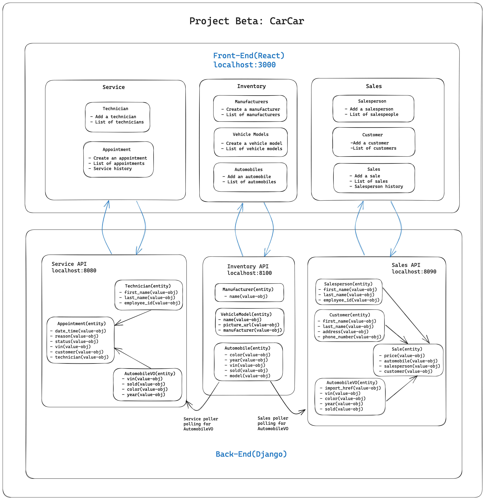

# DealerDashboard

This is a program to help you manage your car dealership.

Brought to you by:

* Alan Y.C. Cheng - Service Microservice
* Sarina Wu - Sales Microservice

## Step-by-step Instructions to Run the Project

1. Open Terminal on your computer

2. Go to the folder where you want to save this program (replace the path with the path to your folder destination):

```
cd {path to your folder}
```

3. Run the following command in your Terminal to download the code of this program to your computer via the "Clone with HTTPS" method:

```
git clone https://github.com/wsrn829/DealerDashboard.git
```

4. Dive into the newly downloaded program folder:

```
cd DealerDashboard
```

5. Create a new database (Docker Volume) with the name "beta-data" in your local computer for this program to store data in:

```
docker volume create beta-data
```

6. Create the blueprints (Docker Images) for the program:

```
docker-compose build
```

7. Create the isolated environments (Docker Containers) for the program:

```
docker-compose up
```

8. The program is now running, please go to the following link to visit the front end in your browser:

http://localhost:3000

9. Enjoy the program.


## Diagram of the Project




## Explicitly defined URLs and ports for each of the services

Program Front End: http://localhost:3000/

Inventory (Monolith): http://localhost:8100/

Service Microservice: http://localhost:8080/

Sales Microservice: http://localhost:8090/


### Inventory (Monolith) CRUD Route Documentation

List Manufacturers (GET)
http://localhost:8100/api/manufacturers/


